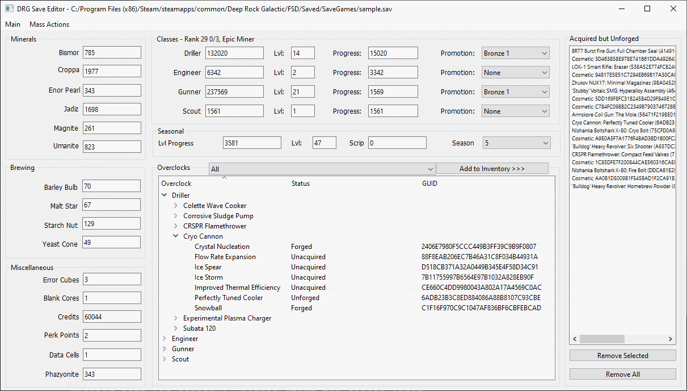

# Deep Rock Galactic Save Editor
This is a standalone DRG save editor written in python (3.6.12), using PyQt5 (5.9.2) and PySide2 (5.15.2) and packaged using the [fman build system](https://build-system.fman.io). 

## Requirements
- Windows 7 (or compatibility mode)
- ???

## Installation
Download the "DRG Save Editor.zip" file and extract the zip file and start the editor using the "start editor.cmd" batch file. 

## Usage

### ALWAYS BACKUP YOUR SAVE FILE!
The editor will make a backup of the save file you open in the same folder as the save file with the extension of `.old`. The editor makes this backup at the moment you open the save file.

The editor should be pretty self-explanatory, see the screenshot below.

Some notes:
- There is a context menu in the overclock tree listing to add overclocks to the inventory
- You can CTRL+Click on overclocks to select more than one
- Changing XP values will update the other relevant fields when the focus changes (i.e., click on a different part of the program or another program entirely)

## Changelog
- v1.3.4
    - Fixed a bug related to editing perk points when using a new save or a save that doesn't have any available perk points
    - Added player rank calculation and rank title to the classes area
- v1.3.3
    - Fixed a bug related to opening saves that have not forged any overclocks
    - Fixed a bug where resource counts would get mixed up
- v1.3.2
    - Fixed a bug in saving the game file that would truncate the save to a few hundred bytes
- v1.3.1
    - Forgot what I fixed here, lol
- v1.3
    - Added promotion support
    - Added "Remove Selected" and "Remove All" buttons for the overclock inventory
    - Updated "DRG Save Editing.txt" to correctly specify XP locations
    - Refactored code to integrate with pytest (6.2.1)
    - Fixed a critical bug that caused the editor to crash on opening a save file
- v1.2
    - Added auto-backup of save file upon opening the file
    - Fixed bug with fetching xp values where the dwarves would have their xp values swapped
- v1.1
    - Fixed a bug with the overclock tree and overclock inventory wouldn't update properly when opening another save file after opening the first
- v1.0
    - Initial release

## To-Do
- Cosmetic overclock support
- GUI polish
- Better readme
- "Restore from backup" option in toolbar menu

## Would be nice, but ehh...
- Assignment support
- Character loadout support
- Perk support
- Weapon modification support
- Milestone support
- Bells & Whistles